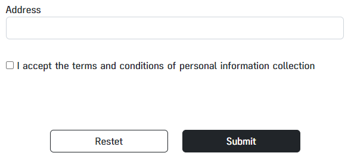
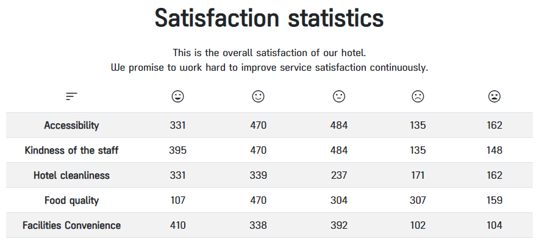

## 🏨JEJU L4 Hotel Survey . Front Ver🏨  
   
###  Project Team NAME : <ㅎㅎ> 👻
-----------------------  

### ⚙️ 구현 화면  
- [L4 Hotel Survey (1차)](https://hhnebula.github.io/Toy_Project/docs/html/index.html)     
  
- [L4 Hotel Survey (2차)](https://hhnebula.github.io/Toy_Project/docs/refactoring/index.html)  
  

### ✈️ 소개  
JEJU L4 Hotel Survey 은 호텔의 서비스 품질향상을 위해 설문조사 및 통계 기능을 가지고 있습니다.  
실제 JEJU L4 Hotel Survey 에 방문한 방문자들을 대상으로 ID,PW,CheckIN일자로 방문자 검증을 후 1:1 설문 서비스를 제공합니다.  
이전 [L4 Hotel Survey_Java ver](https://github.com/HyeonTtora/KH_SemiProject/blob/master/README.md) 과 해당 프로젝트의 가장 큰 차이점인 front구현으로 사용자는 더 편리하고, 직관적으로 설문을 작성하고 통계를 확인할 수 있습니다.  필수 입력란 미입력 시 사용자에게 알람을 주어 설문/회원가입/로그인/ID,PW찾기 등의 필수 입력란을 놓치지 않고 오타와 미입력을 방지합니다. 체크하는 답항은 강조표시 되어 설문 오입력을 방지합니다.  

### 🛠 기능 요약  
1. 실제 L4호텔에 방문한 고객 검증을 위해 회원가입 후 ID/PW/Check_IN 일자를 확인 합니다.
2. 통계 선택 시 실제 방문자의 모든 문답을 통계하여 실제 서비스 만족도를 한눈에 확인할 수 있습니다.  
3. HTML의 required 속성으로 필수 입력란 미입력 시 사용자에게 알람을 주어 설문/회원가입/로그인/ID,PW찾기 등의 필수 입력란을 놓치지 않습니다.
4. CSS의 가상클래스와 선택자를 활용해 설문 진행 시 사용자가 체크한 답항을 강조하여 오답을 방지합니다.  
-----------------------

### ⏰ 개발 기간
[1차]2022년 11월 10일 ~ 2022년 11월 11일  
[2차]2022년 12월 8일 ~ 2022년 12월 9일 
### 📌 기술
HTML, CSS , Bootstrap
VisualStudioCode, git  

### 🔍<ㅎㅎ> 팀 멤버 한줄 소개  
   
### 👨‍💻 하성수(팀장)  
스토리보드 작성, PPT 작성
공통 화면, 홈 화면, 설문 통계 화면, 회원 가입 화면 설계 및 구현  

### 👩‍💻 김현정  
스토리보드 작성, Git 관리, 업무 흐름도 제작
로그인 화면, 설문지 화면,  아이디, 비밀번호 찾기 화면 설계 및 구현


-----------------------
### 🔗 라이브 영상  
- [JEJU L4 Hotel Survey_Live](https://www.youtube.com/watch?v=qNAzFQ3t0SM)  
  
### 💻 CodeArchitecture  
- [CodeArchitecture](./docs/Storyboard/codearchitectures.png)  

### ⚙️ 구현 화면  

### [1차]
- [Home (메인 홈화면 이미지)](./docs/img/signup.png)
- [Signup (회원가입 화면 이미지)]("./docs/img/signup.png)
- [Log in (로그인 화면 이미지)](./docs/img/login.png)
- [Find_id_pw (ID/PW 찾기 화면 이미지)](./docs/img/id_pw_find.png)
- [Survey (설문지 작성 화면 이미지)](./docs/img/survey.png)
- [Review (설문지 통계 화면 이미지)](./docs/img/review.png)


### [2차]
- 

-----------------------

### 📝 부트스트랩 버전 주요 코드

#### 회원 가입 페이지 내 약관 동의 모달



```html
<!-- 체크 박스와 라벨에 동일한 모달 속성을 부여하여 클릭 시 체크 및 약관 동의 모달 노출 -->
<div class="row justify-content-center">
    <div class="form-group col-12 col-md-8 my-3">
        <!-- 약관 동의 체크박스 -->
        <input type="checkbox" name="agree" id="agree" required data-bs-toggle="modal" data-bs-target="#staticBackdrop">
        <!-- 약관 동의 라벨 -->
        <label for="agree">
            <p data-bs-toggle="modal" data-bs-target="#staticBackdrop">
                I accept the terms and conditions of
                personal information collection
                </p>
        </label>
    </div>
</div>

<!-- 개인정보 약관 modal-->
<div class="modal fade" id="staticBackdrop" data-bs-backdrop="static" data-bs-keyboard="false" tabindex="-1"
    aria-labelledby="staticBackdropLabel" aria-hidden="true">
    <div class="modal-dialog">
        <div class="modal-content">
            <div class="modal-header">
            <!-- 생략 -->
```
#### 통계 페이지 컬럼명을 아이콘으로 대체



```html
<table class="table table-striped table-responsive">
    <thead>
        <tr>
            <th class="w-25" scope="col">
                <span class="material-symbols-outlined">sort</span>
            </th>
            <th scope="col">
                <span class="material-symbols-outlined">sentiment_very_satisfied</span>
            </th>
            <th scope="col">
                <span class="material-symbols-outlined">sentiment_satisfied</span>
            </th>
            <th scope="col">
                <span class="material-symbols-outlined">sentiment_neutral</span>
            </th>
            <th scope="col">
                <span class="material-symbols-outlined">sentiment_dissatisfied</span>
            </th>
            <th scope="col">
                <span class="material-symbols-outlined">sentiment_very_dissatisfied</span>
            </th>
        </tr>
    </thead>
    <!-- 생략 -->
```
-----------------------
### [1차]  
### 화면 정의서
- [화면정의서](./docs/Storyboard/StoryBoard.pdf)  

### 요구사항 정의서
- [요구사항 정의서](./docs/Storyboard/Requirements.pdf)  

### HTML  
- [index](/docs/html/index.html)  
- [signup](/docs/html/signup.html)  
- [login](/docs/html/login.html)  
- [find_id_pw](/docs/html/find_id_pw.html)  
- [review](/docs/html/review.html)  
- [survey](/docs/html/survey.html)  
- [survey_done](/docs/html/survey_done.html)  

### CSS
- [index](/docs/css/index.css)  
- [login](/docs/css/login.css)  
- [review](/docs/css/review.css)  
- [signup](/docs/css/signup.css)  
- [survey](/docs/css/survey.css)  

### [2차]  

### HTML  
- [index](/docs/refactoring/index.html)  
- [signup](/docs/refactoring/signup.html)  
- [login](/docs/refactoring/login.html)  
- [find_id_pw](/docs/refactoring/forget_id_pw.html)  
- [review](/docs/refactoring/statistics.html)  
- [survey](/docs/refactoring/survey.html)  

### CSS
- [index](/docs/css/index.css)  
-----------------------
### 🤖 프로젝트 성격 (동기)
해당 프로젝트는 1차적으로 Java로 구현 하였던 프로젝트입니다 (이전 프로젝트 [L4 Hotel Survey_Java ver](https://github.com/HyeonTtora/KH_SemiProject/blob/master/README.md) ) 저희 팀은 이전 프로젝트를 2차로 front로 구현하다보니 프로젝트 기간이 더 짧게 진행된 만큼 front에서의 강점을 최대한 명확하게 보이게 구현할 수 있는 부분 위주로 고민 해보았습니다. 화면으로 보여지는 것은 사용자가 콘솔창보다 더 직관적으로 확인을 할 수 있는 점이 대표적인 장점이라고 생각이 되었습니다. 직관적으로 확인할 수 있는 부분을 활용해 설문 대상자가 설문 또는 회원가입 등 필수 입력값을 입력 시 오타, 공란 등으로 놓칠 수 있는 부분을 더 직관적이게 표현한다면 오답,정보미입력 등을 줄이고, 사용자 또한 어떤 것이 오입력,미입력 되었는지 더 쉽게 확인할 수 있지 않을까? 라는 생각을 가지고 접근하게 되었습니다. 


### 🐤 에피소드 및 느낀점  

이번 프로젝트는 백엔드와 프론트의 장.단점을 깊이 느낄 수 있는 프로젝트였습니다.  
이전 Java로 구현 후 HTML과 CSS로 2차 프로젝트를 진행하니 확실히 이전 프로젝트에서 부족했던 점과 Java에서는 꽤 쉽게 구현했던 것이 오히려 잘 안돼거나 반대로 HTML나 CSS 에서는 쉽게 구현되는 것이 Java에서 되지 않거나 하는 상황을 맞이하며 많은 고민을 하게 되었습니다. 성격이 매우다른 개발환경이였지만 조금더 깊이 프로그래밍의 이해도를 쌓아간 것 같습니다. 더 많은 프로젝트를 경험하고, 공부하고 느끼고싶은 값진 경험이였습니다.


